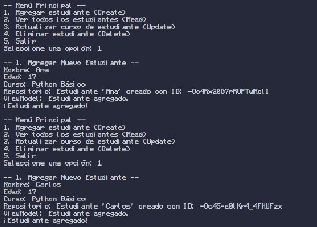
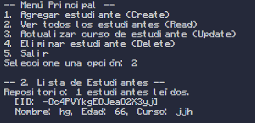
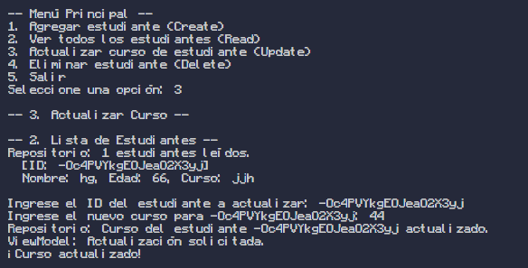

# CRUD de Estudiantes con Firebase y Python (Arquitectura MVVM)

Este proyecto es una aplicación de consola en Python que demuestra cómo realizar operaciones **CRUD (Crear, Leer, Actualizar, Eliminar)** en **Firebase Realtime Database**.

La aplicación sigue una arquitectura limpia (similar a MVVM - Modelo-Vista-ViewModel) para separar la lógica de negocio, el acceso a datos y la interfaz de usuario.

## 🚀 Características

  * **➕ Crear:** Agregar nuevos estudiantes a la base de datos.
  * **📖 Leer:** Mostrar la lista completa de estudiantes.
  * **🔄 Actualizar:** Modificar el curso de un estudiante existente por su ID.
  * **❌ Eliminar:** Borrar un estudiante de la base de datos por su ID.

## 🏗️ Arquitectura del Proyecto

El código está estructurado en capas para mantenerlo organizado y escalable:

  * **`/domain` (Modelo):** Contiene las clases que definen nuestros datos (ej. `Estudiante`).
  * **`/data` (Modelo):** Contiene el "Repositorio". Es la única capa que habla directamente con Firebase (`repository.py`).
  * **`/presentation` (ViewModel):** Es el "puente". La UI le pide cosas (ej. "agregar este estudiante") y el ViewModel llama al Repositorio para hacerlo.
  * **`/ui` (Vista):** La interfaz de usuario de consola. Solo muestra información y recibe entradas del usuario (`console.py`).
  * **`main.py`:** El punto de entrada que inicializa y conecta todas las capas (Inyección de Dependencias).

## 🛠️ Tecnologías Utilizadas

  * Python 3.13
  * `firebase-admin`: SDK de Google para conectar Python con Firebase.
  * `python-dotenv`: Para gestionar variables de entorno (como la URL de la DB) de forma segura.

## ⚙️ Configuración y Puesta en Marcha

Sigue estos pasos para ejecutar el proyecto en tu máquina local.

### 1\. Clonar el Repositorio

```bash
git clone https://github.com/tu-usuario/tu-repositorio.git
cd tu-repositorio
```

### 2\. Crear un Entorno Virtual (Recomendado)

```bash
python -m venv venv
source venv/bin/activate  # En Windows: venv\Scripts\activate
```

### 3\. Instalar Dependencias

Asegúrate de tener el archivo `requirements.txt` en la raíz con este contenido:

```txt
firebase-admin
python-dotenv
```

Luego, instálalo:

```bash
pip install -r requirements.txt
```

### 4\. Configurar Credenciales de Firebase

1.  Ve a tu [Consola de Firebase](https://console.firebase.google.com/).
2.  Ve a **Configuración del proyecto** (el ícono de engranaje ⚙️).
3.  Ve a la pestaña **Cuentas de servicio**.
4.  Haz clic en **"Generar nueva clave privada"** y guarda el archivo `.json` que se descarga.
5.  **Importante:** Renombra este archivo (ej. `credencial.json`) y colócalo en la **carpeta raíz** de tu proyecto.

### 5\. Configurar Variables de Entorno

1.  Crea un archivo llamado `.env` en la raíz del proyecto.

2.  Abre tu **Realtime Database** en la consola de Firebase y copia su URL.

3.  Agrega el siguiente contenido al archivo `.env`, reemplazando los valores:

    ```ini
    # Pega la URL de tu Realtime Database
    DATABASE_URL="https://tu-proyecto-12345-default-rtdb.firebaseio.com"

    # Escribe el nombre exacto de tu archivo JSON de credenciales
    FIREBASE_CREDENTIALS_PATH="tu-credencial.json"
    ```

**¡IMPORTANTE\!** Asegúrate de que tus archivos `.env` y `tu-credencial.json` estén listados en tu archivo `.gitignore` para no subirlos a GitHub.

```
# .gitignore
venv/
__pycache__/
.env
*.json
```

## ▶️ Ejecución

Una vez configurado, simplemente ejecuta el archivo `main.py`:

```bash
python main.py
```

## 📸 Evidencia de Funcionamiento

A continuación, se muestra el flujo de la aplicación realizando las 4 operaciones CRUD.

### 1\. Iniciar la App y Crear (Create)

Se inicia la aplicación y se selecciona la opción 1 para agregar dos estudiantes: "Ana" y "Carlos".

.

### 2\. Leer (Read)

Se selecciona la opción 2 para verificar que los estudiantes fueron creados. Firebase les asignó IDs únicos.

.

### 3\. Actualizar (Update)

Se selecciona la opción 3. Se usa el ID de "Ana" para actualizar su curso de "Python Básico" a "Python Intermedio".

.


